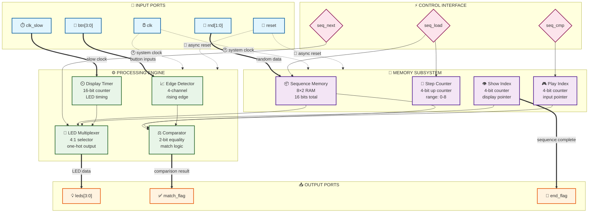

# Projeto do Caminho de Dados - Jogo da Memória

## Diagrama do Datapath

## Componentes Principais

### Memória da Sequência
- **Tipo**: Array 8x2 bits
- **Função**: Armazena sequência de LEDs
- **Controle**: seq_load para escrita

### Contadores
- **step_count**: Número de passos na sequência atual
- **show_idx**: Índice para exibição da sequência  
- **play_idx**: Índice para verificação do jogador

### Detector de Botões
- **Entrada**: button_i[3:0] (debounced)
- **Função**: Detecta borda de subida
- **Saída**: Índice do botão pressionado

### Comparador
- **Função**: Compara botão vs sequência esperada
- **Saída**: match_flag

### Multiplexador de LEDs
- **Função**: Seleciona LED ativo durante SHOW
- **Controle**: clk_slow + seq_next

## Sinais de Dados

| Sinal | Largura | Função |
|-------|---------|---------|
| sequence | 8x2 bits | Array da sequência |
| step_count | 4 bits | Contador de passos |
| show_idx | 4 bits | Índice de exibição |
| play_idx | 4 bits | Índice do jogador |
| pressed_idx | 2 bits | Botão pressionado |
| leds_reg | 4 bits | Registro dos LEDs |