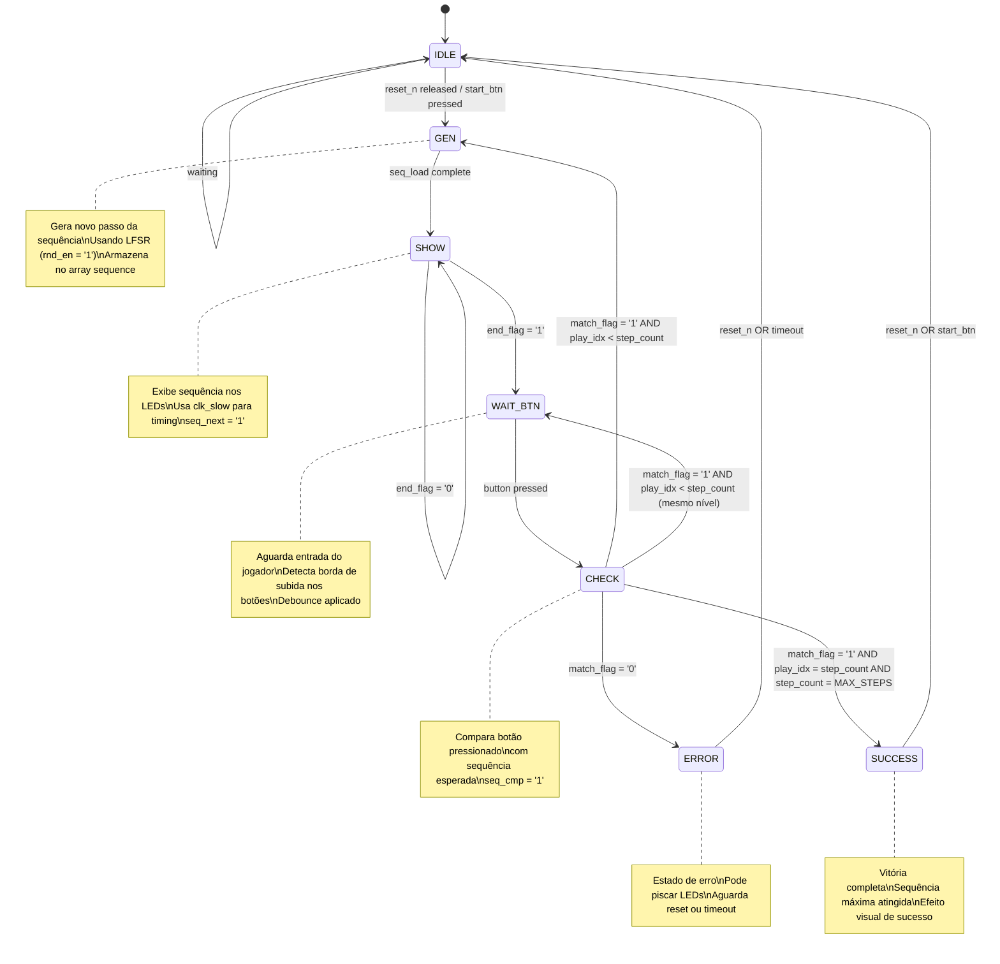

# Projeto da Máquina de Estados - Jogo da Memória (Simon-like)

## Diagrama da FSM de Alto Nível

## Estados Detalhados

### IDLE
- **Função**: Estado inicial, aguarda início do jogo
- **Entradas**: reset_n, start_btn
- **Saídas**: Todos os sinais de controle em '0'
- **Transição**: Para GEN quando start_btn pressionado

### GEN (Generate)
- **Função**: Gera novo passo da sequência usando LFSR
- **Entradas**: rnd_bit[1:0] do LFSR
- **Saídas**: seq_load = '1', rnd_en = '1'
- **Transição**: Para SHOW após armazenar novo passo

### SHOW
- **Função**: Exibe a sequência atual nos LEDs
- **Entradas**: end_flag do datapath
- **Saídas**: seq_next = '1'
- **Transição**: Para WAIT_BTN quando end_flag = '1'

### WAIT_BTN
- **Função**: Aguarda entrada do jogador
- **Entradas**: button_i[3:0] (debounced)
- **Saídas**: Nenhuma saída ativa
- **Transição**: Para CHECK quando botão pressionado

### CHECK
- **Função**: Verifica se entrada do jogador está correta
- **Entradas**: match_flag do datapath
- **Saídas**: seq_cmp = '1'
- **Transições**:
  - Para GEN se correto e sequência não completa
  - Para SUCCESS se correto e sequência completa
  - Para ERROR se incorreto

### ERROR
- **Função**: Estado de erro, indica falha do jogador
- **Entradas**: reset_n
- **Saídas**: Pode controlar efeito visual de erro
- **Transição**: Para IDLE com reset

### SUCCESS
- **Função**: Estado de vitória, sequência máxima completada
- **Entradas**: reset_n, start_btn
- **Saídas**: Pode controlar efeito visual de sucesso
- **Transição**: Para IDLE para novo jogo

## Sinais de Controle

| Sinal | Origem | Destino | Função |
|-------|--------|---------|---------|
| seq_load | Controller | Datapath | Armazena novo passo da sequência |
| seq_next | Controller | Datapath | Avança exibição da sequência |
| seq_cmp | Controller | Datapath | Compara entrada do jogador |
| rnd_en | Controller | LFSR | Habilita geração de número aleatório |
| match_flag | Datapath | Controller | Indica se jogador acertou |
| end_flag | Datapath | Controller | Indica fim da exibição |

## Parâmetros Configuráveis

- **MAX_STEPS**: 8 (máximo de passos na sequência)
- **CLK_SLOW_DIV**: Divisor para clock de exibição
- **DEBOUNCE_TIME**: Tempo de debounce dos botões