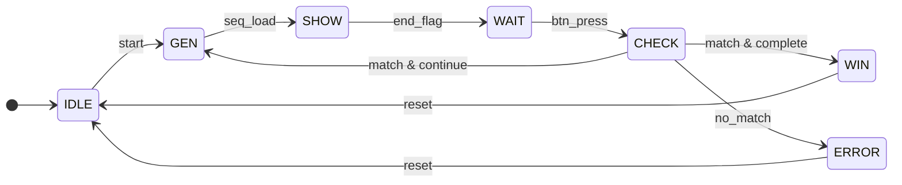

# FSM Horizontal - Jogo da Memória

```mermaid
stateDiagram-v2
    direction LR
    
    [*] --> IDLE
    IDLE --> GEN : start
    GEN --> SHOW : seq_load
    SHOW --> WAIT : end_flag
    WAIT --> CHECK : btn_press
    CHECK --> GEN : match & continue
    CHECK --> WIN : match & complete
    CHECK --> ERROR : no_match
    ERROR --> IDLE : reset
    WIN --> IDLE : reset
```