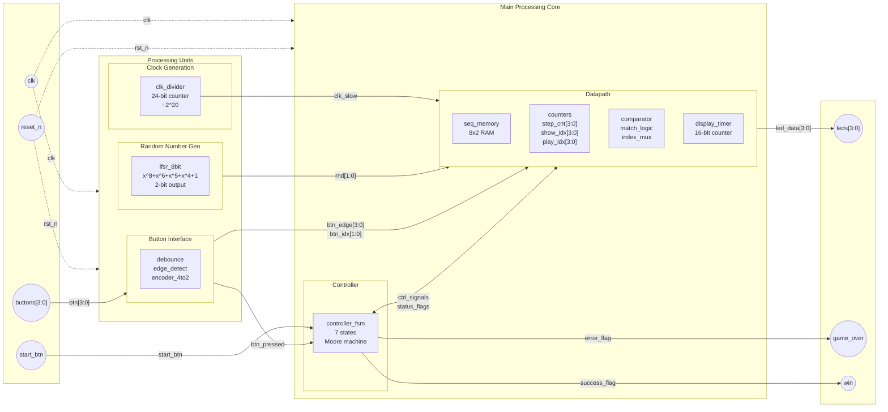

# Projeto RTL - Memory Game (Simon-like)

## RTL Architecture Overview

### Processing Units
| Module | Function | Implementation |
|--------|----------|----------------|
| clk_divider | Clock generation | 24-bit counter, ÷2^20 |
| lfsr_8bit | Random generation | 8-bit LFSR, polynomial x^8+x^6+x^5+x^4+1 |
| debounce | Button interface | Edge detect + 4:2 encoder |

### Controller FSM
- **Type**: Moore machine, 7 states
- **States**: IDLE → GEN → SHOW → WAIT → CHECK → ERROR/WIN
- **Outputs**: Control signals (seq_load, seq_next, seq_cmp)

### Datapath Components
| Component | Size | Function |
|-----------|------|----------|
| seq_memory | 8×2 RAM | Sequence storage |
| step_cnt | 4-bit counter | Current sequence length |
| show_idx | 4-bit counter | Display index |
| play_idx | 4-bit counter | Player input index |
| comparator | Combinational | Match detection logic |
| display_timer | 16-bit counter | LED timing control |

### Control/Status Signals
- **Control Bus**: seq_load, seq_next, seq_cmp, rnd_en
- **Status Bus**: match_flag, end_flag, btn_pressed
- **Data Bus**: rnd[1:0], btn_idx[1:0], led_data[3:0]